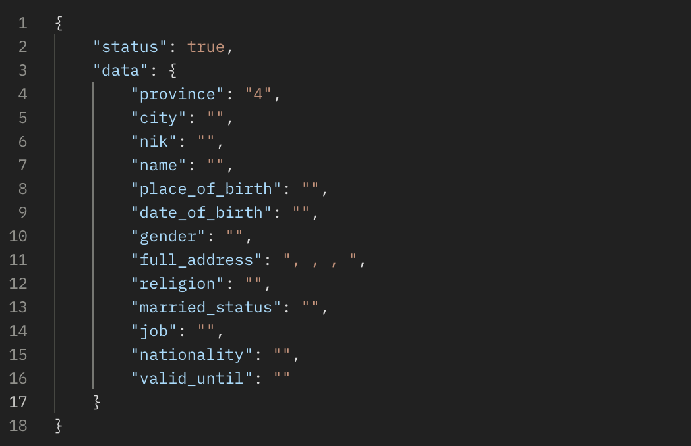

# Sample OCR End User

## Clean Architecture with GoFiber

End-User service build with Go using GoFiber, Gorm, MongoDB, MySQL & etc

## Installation

In order to run the project, please follow the following steps:

1. Clone the Repo
2. Run `go get`
3. Change environtment configuration based on your local machine
4. Run `go run .` or `go build`

## Expect Result

- 
